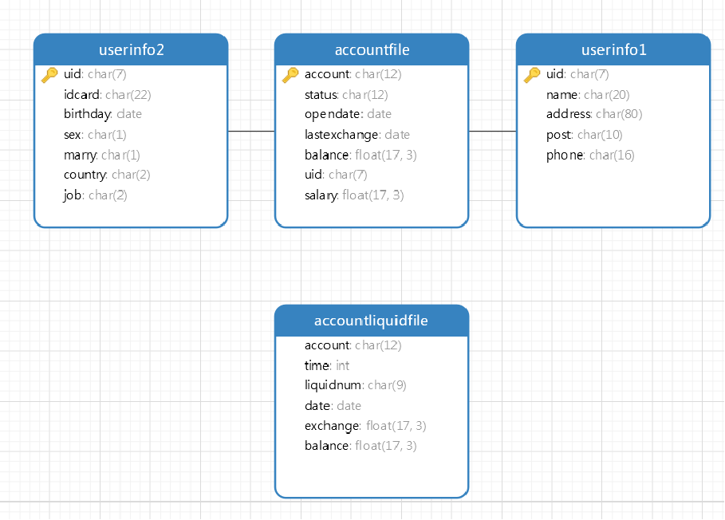
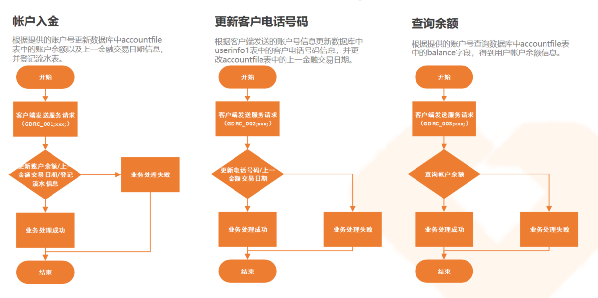
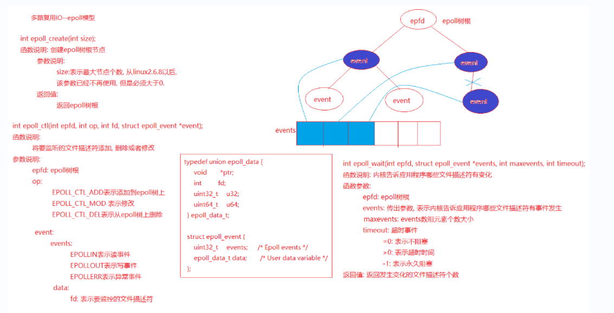
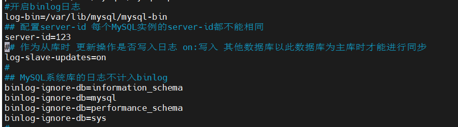
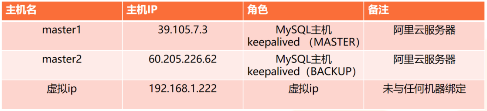
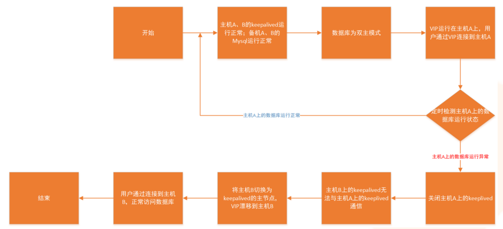

# 项目介绍
基于云服务器环境和数据同步需求，设计了一套完整的银行业务交易系统的数据同步解决方案。（广东省农信联社金融科技校园挑战赛云计算赛道（冠军 + 最佳人气奖））
### 项目依赖
- 两台云服务器
- Mysql8.0.29
- Keepalived v1.3.5
- libxml2-2.8.0
- gcc7&g++7
### 项目主要内容
- 采用事务提交的方式，将百万级别的数据高效的导入到主备数据库中。
- 实现了账户入金，查询余额，更新客户信息等银行交易系统的业务逻辑。
- 基于 Epoll 模型开发了后端服务器。
- 使用 Binlog 实现了主备数据库同步，将主数据库中的数据快速，可靠的同步到备份数据库中。
- 使用 Mysql 的双主模式和 Keepalived 配置，实现了双主热备，保证系统的高可用性。
### 数据链接：
链接：https://pan.baidu.com/s/16WE1lGTLJwgX7dajDQZUIg 
提取码：d861
#### 数据表设计（E-R图）

#### 基本业务逻辑设计

#### Epoll模型相关函数

#### 主从数据库同步配置
（1）master1:/etc/my.cnf

（2）master2:/etc/my.cnf

#### 双主热备配置
- 基本信息

- 双主热备实现流程图

